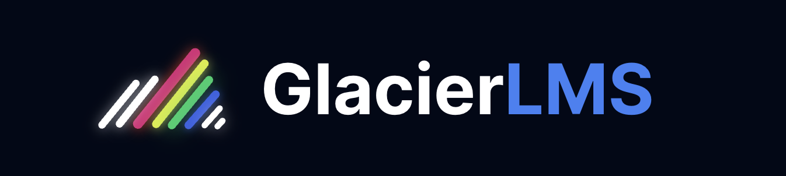

# Patriot Hacks 2023

Hi there! This is the submission for Reman Hogbisz at Patriot Hacks for <strong>GlacierLMS</strong>

## Where to find the project

The project can be found at [glacier.hogbisz.com](https://glacier.hogbisz.com)

## What is GlacierLMS?

<strong>GlacierLMS</strong> is a conglomeration of different services offered by Reman Hogbisz joined together in one package for school systems to utilize for their students. It is a modular platform designed to allow for school systems to pick and choose our platforms as well as develop their own to integrate into our system.

The idea is that this service will be used to house student, staff, and school information in a secure and easy to use manner. This information will be exposed via a secured API. This will not only assist in administration of students via <strong>GlacierPortal</strong>, but also allow for the creation of other services that can be used by students and staff.

## What is GlacierPortal?

<strong>GlacierPortal</strong> is the system found at [glacier.hogbisz.com](https://glacier.hogbisz.com). It is an administration platform that will allow for staff to manage students, classes, schedules, and all sorts of other information stored on our platform. It will also allow staff to set permissions for other platforms connected to <strong>GlacierLMS</strong>. Think of it as a control panel for the school system.

---

The idea for this project has been in the works for a little while, but thanks to Patriot Hacks, we've finally had the opportunity to create it! Thank you all!
